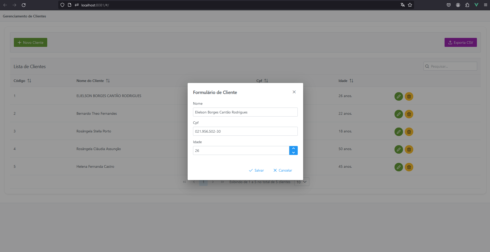
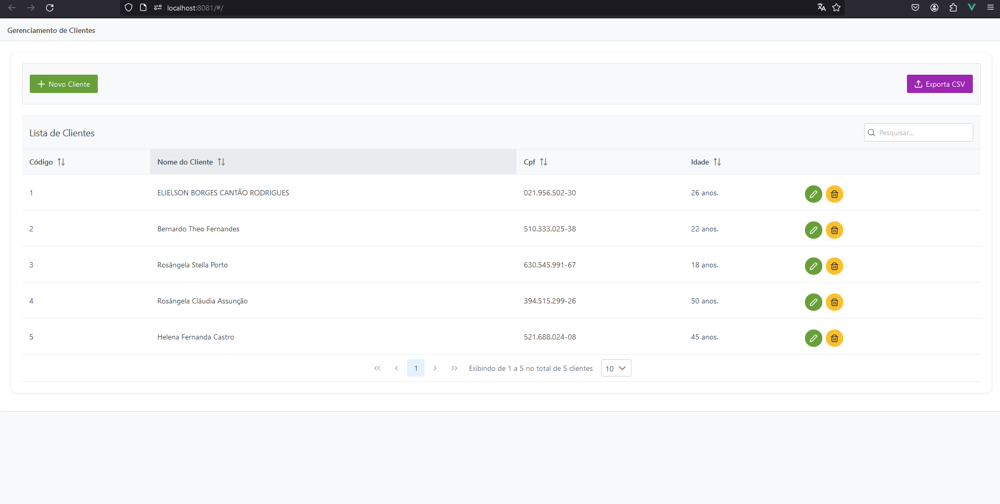
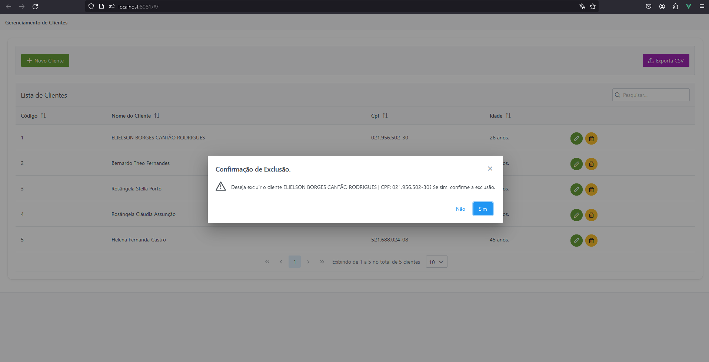
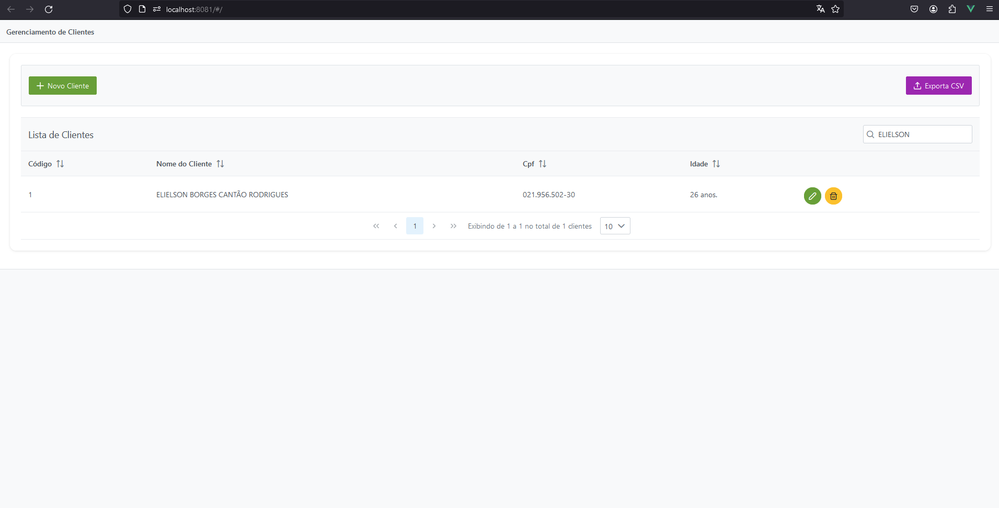
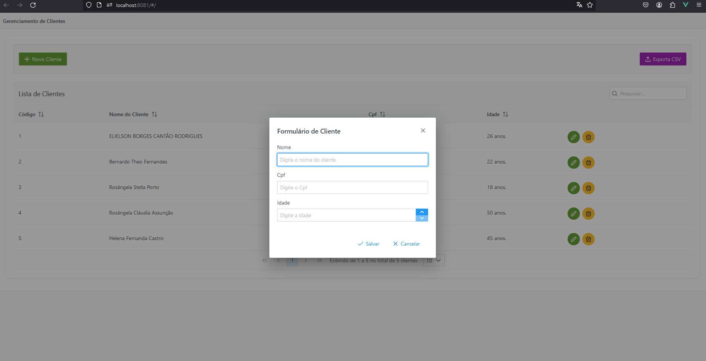

#  FRONT-END QUE CONSOME A API DE CLIENTES

<h4 align="center"> 
	🚧 CLIENTE-UI
</h4>

## ✅ Funções

- <h3>GERENCIAMENTO DE CLIENTES</h3>

  - [x] LISTAGEM DE CLIENTES
  - [x] PESQUISA DE CLIENTES
  - [x] CADASTRO DE CLIENTES
  - [x] ATUALIZAÇÃO DE CLIENTES
  - [x] EXCLUSÃO DE CLIENTES

## 📚 Descrição

- Crud simples de clientes.

## 🛠 Tecnologias

As seguintes ferramentas foram usadas na construção do projeto:

- [Vue.js](https://vuejs.org/)
- [HTML](https://www.w3schools.com/html/default.asp)
-  [CSS](https://www.w3schools.com/css/)
-  [JavaScript](https://developer.mozilla.org/pt-BR/docs/Web/JavaScript)

## 📱 Plataforma adotada

- Web;

## 📸 Screenshot
<p float="left">
    
	
	
	
	
</p>
 
## COMO RODA A APLICAÇÃO;
           
### INSTALAR AS DEPENDENCIAS

```
npm install
```

## COMANDO PARA LEVANTAR O SERVIDOR DO NODE
```
npm run serve
```
